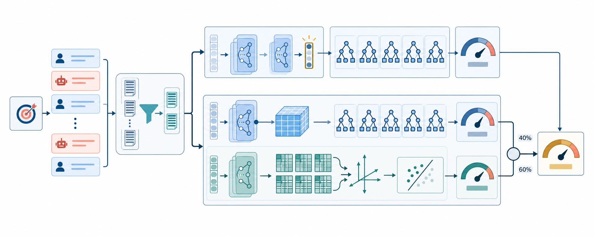
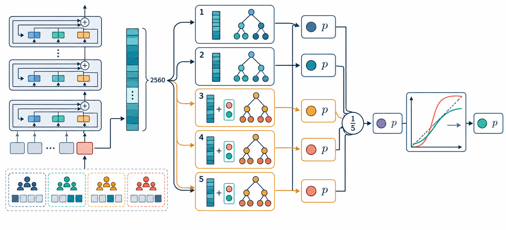
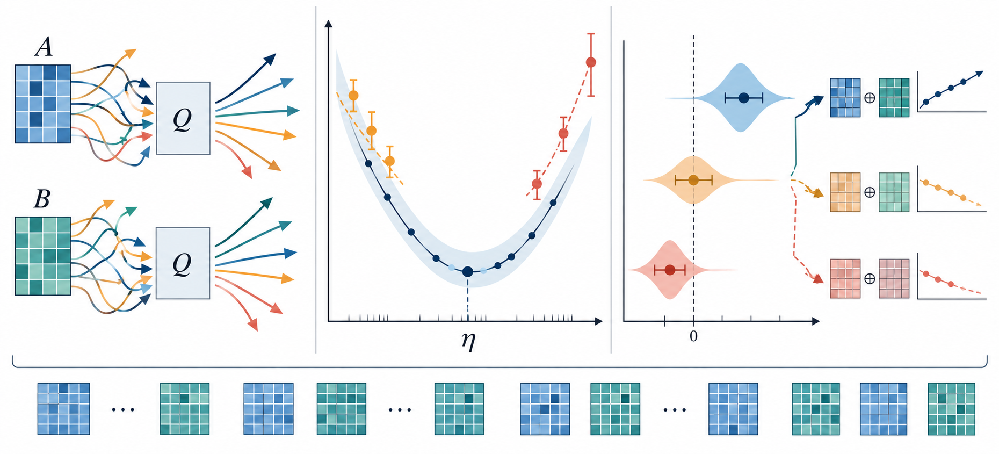

# Matrix-Aware LoRA Optimization for Calibrated Tutoring Assessment

**Officially fourth. Our central contribution is an audited Muon-LoRA recipe that assigns
all 505 trainable matrices to Muon with zero fallback.**

*Figure 1. From dialogue evidence to calibrated probability. Muon reshapes the optimization
geometry of all 505 trainable LoRA and classification matrices; the resulting representation
provides both a stronger standalone prediction and complementary errors for the calibrated
two-branch system.*

## 1. Summary

Predicting whether a student answered correctly from a tutoring transcript is both a
language-understanding and probability estimation problem. Our system preserves the
learning objective and salient evidence from long dialogues, learns a Qwen3-4B LoRA
representation, and separates semantic encoding from nonlinear probability estimation and
calibration. All model selection used session-disjoint splits; calibration was cross-fitted
by session and uncertainty was estimated by resampling sessions rather than rows.

We officially ranked fourth with **0.59449 Log Loss and 0.64985 AUROC** on the private
leaderboard. Our central technical contribution is a fully audited Muon-LoRA recipe for
long-context outcome classification: all 505 trainable matrices were optimized by Muon with
zero AdamW fallback. This reduced frozen single-model Log Loss from **0.593883 to 0.591436**;
a paired session-bootstrap estimated a mean gain of 0.002441 with 95% interval
**[0.000650, 0.004234]**. A subsequently completed two-branch research system reached
**0.590509 / 0.657425** on the released labeled benchmark. This numerical pair is stronger
than every displayed leaderboard row, but it is not an official private leaderboard result.

Our work makes three contributions:

1. **Audited Muon-LoRA.** We transfer matrix-orthogonalized optimization to every LoRA
   factor and the classification matrix, then verify the realized assignment at runtime:
   505 Muon matrices and zero fallbacks.
2. **Mechanistic evidence.** A narrow learning rate optimum, improvements before
   ensembling, and two opposite optimizer-routing controls show that the gain depends on
   coordinated representation and head optimization.
3. **Calibrated heterogeneous prediction.** Session-disjoint validation, five-model
   hidden-state XGBoost, grouped beta calibration, and optimizer-diverse fusion jointly
   optimize Log Loss while preserving a practical inference path.

*Figure 2. One transcript construction feeds two complete, auditable paths. The competition
path uses final-token XGBoost and grouped beta calibration; the completed system combines
an AdamW Layer-28 XGBoost branch with an audited Muon-LoRA classification branch.*

The competition-time XGBoost system used Qwen3-4B's final valid-token hidden-state vector, five
regularized XGBoost models, and cross-fitted beta calibration. It improved public/A Log
Loss from 0.6000 to **0.5966** while retaining 0.6464 AUROC. Our best retained probability
file was a distinct submission: it scored 0.59663 / 0.64465 on public/A and ultimately
ranked fourth on private/B:

| Final private/B leaderboard | Log Loss | AUROC |
|---|---:|---:|
| #1, oleh | 0.59233 | 0.65088 |
| #2, appleswim | 0.59241 | 0.64735 |
| #3, Team Chicken | 0.59280 | 0.64737 |
| **Our #4 result** | **0.59449** | **0.64985** |

Our strongest method extension concerns optimization inside LoRA. Muon was developed and
scaled mainly for dense matrix optimization in language model training [3]. LoRA instead
freezes the backbone and learns factorized low-rank updates `Delta W = (alpha/r) B A` [2].
We applied Muon's matrix-orthogonalized momentum to all trainable LoRA factors and the
classification matrix, then audited actual optimizer membership at runtime. At its best
tested learning rate, this **Muon-LoRA recipe** improved both discrimination and
calibration before any new model was added: frozen robust Platt Log Loss fell from
**0.593883 to 0.591436**, raw Log Loss fell from **0.623250 to 0.616465**, and AUROC rose
from **0.650021 to 0.653200**. The single-model system still uses one Qwen forward pass and a
linear classification head at inference.

> **Primary finding.** Muon-LoRA improved the frozen single-model endpoint from 0.593883 /
> 0.650021 to 0.591436 / 0.653200. The paired session-bootstrap supports a positive Log Loss
> gain. This result requires neither XGBoost nor model fusion.

We do not claim to have invented Muon for low-rank adaptation. Recent work confirms that
LoRA's factorization creates a genuine geometric ambiguity and motivates specialized
low-rank optimization [4]. Our contribution is an end-to-end application and evidence
chain for long-context educational classification: exact optimizer auditing,
optimizer-specific learning rate scaling, frozen calibration, opposite module-routing
controls, and optimizer-diverse ensembling.

## 2. Data, Validation, and Transcript Construction

For each response, we combined the target learning objective with the chronological,
role-marked tutoring transcript. IDs were excluded from model text; timestamps were retained
when available to preserve conversational order.

A tutoring session can generate several response-objective rows. Random row splitting
would therefore leak nearly identical conversations across train and validation. We grouped
every model selection split by `session_id`, maintained an untouched development partition,
and estimated uncertainty by resampling sessions rather than rows. Calibration parameters
were fitted only from grouped development predictions and then frozen.

The submitted path used right truncation at 10,240 tokens. A later 2x2 audit studied a
Head-tail policy that preserved the task prefix and split the content budget 35/65 between
the beginning and end. Train/inference mismatches degraded sharply, showing that context
selection is part of the learned task definition.

## 3. Outcome Representation and Probability Head

We fine-tuned Qwen3-4B-Instruct-2507 [1] as a two-class sequence classifier using ms-swift:
one epoch, LoRA rank256/alpha512, CE loss, AdamW at 1e-5, cosine decay with 3% warmup,
weight decay 0.1, bfloat16, SDPA, gradient checkpointing, and global batch four.

For each example, we saved the final layer at the last non-padding token, a 2,560-
dimensional vector denoted `h_final`, and the two classification logits. The final-token state is
a natural aggregation point in a causal Transformer because it follows both the objective
and all retained dialogue evidence.

Five regularized XGBoost models [5] formed the probability head: two consumed `h_final` and
three consumed `[h_final; logits]`. Hyperparameters and ensemble size were selected only on
session-grouped development results. The arithmetic ensemble added diversity without another
Transformer forward pass.

*Figure 3. A single Transformer pass supplies the final-token representation and logits to five
regularized tree heads. Averaging controls variance; grouped beta calibration then reshapes
probabilities without changing their ranking.*

We then applied beta calibration [6] to the averaged probability:

`p_cal = sigmoid(a log(p) - b log(1-p) + c)`.

The coefficients were learned with grouped cross-fitting, so the calibrator never fitted a
row using that row's in-fold prediction. On validation, Log Loss improved from 0.5634 for
the native Qwen head to 0.5371 for a frozen linear probe, 0.5360 for the five-model XGBoost
mean, and 0.5356 after beta calibration; AUROC rose from 0.7196 to 0.7327. This division of
labor is useful: Qwen models semantic interaction evidence, XGBoost learns a regularized
nonlinear decision surface, model averaging controls tree variance, and beta calibration
corrects asymmetric probability distortion without changing ranking.

## 4. Muon for Low-Rank Adaptation

### 4.1 Why the transfer is nontrivial

AdamW rescales coordinates of each trainable factor. Muon instead constructs a momentum
matrix and approximately orthogonalizes it with Newton-Schulz iterations [3]:

`M_t = mu M_(t-1) + G_t`,   `O_t approx M_t (M_t^T M_t)^(-1/2)`,

The transposed form is used for wide matrices; weight decay and shape-aware scaling follow
the scalable Muon implementation. This changes training geometry, not inference.

For LoRA, `(B R)(R^(-1) A) = B A`, so many factor pairs describe the same adapter [4].
Factor-wise Muon is therefore not equivalent to optimizing the dense update. We do not claim
to invent Muon; we establish and audit a practical Muon-for-LoRA recipe for this task.

LoRA on seven projections in each of 36 blocks produced 504 adapter matrices; the score
matrix was the 505th. A runtime callback enumerated every parameter and verified **505 Muon
matrices, zero AdamW fallbacks**, four-GPU DDP, global batch four, finite losses/gradients,
and the registered learning rate.

*Figure 4. The Muon-LoRA evidence chain connects matrix-momentum orthogonalization, a narrow
learning rate optimum, paired session-bootstrap gains, and two falsifying split routing
controls. Together these tests support a coordinated optimizer recipe rather than a
head-only or post-processing explanation.*

### 4.2 An evidence ladder for Muon-LoRA

We kept the 35,072 training rows, backbone, CE objective, LoRA rank and alpha, seed, epoch
count, four-GPU execution, global batch, and input policy fixed. Within the Muon sweep,
learning rate was the only changed training hyperparameter. The AdamW reference retained
its own development-selected 1e-5 rate, so this comparison establishes an
optimizer-specific recipe rather than a pure optimizer-only causal estimate.

| Evidence step | Evaluation | Log Loss | AUROC | What it tests |
|---|---|---:|---:|---|
| AdamW LR 1e-5, robust Platt | Released benchmark | 0.593883 | 0.650021 | Frozen single-head reference |
| Muon LR 2e-5, robust Platt | Released benchmark | 0.592714 | **0.653213** | Optimizer and error diversity |
| **Muon LR 2.5e-5, robust Platt** | **Released benchmark** | **0.591436** | 0.653200 | Best single neural endpoint |
| Muon LR 3e-5, robust Platt | Released benchmark | 0.600297 | 0.636753 | Learning rate boundary |
| Muon LR 1e-4, robust Platt | Released benchmark | 0.632914 | 0.547550 | High-rate failure control |
| Muon-LoRA + AdamW head, robust Platt | Released benchmark | 0.594456 | 0.647799 | Full-data split routing regresses |
| AdamW LoRA + Muon head, beta | Untouched development | 0.545988 | 0.717540 | Reverse split routing regresses |
| Corresponding AdamW baseline, beta | Untouched development | **0.541474** | **0.725394** | Reverse-audit reference |
| AdamW + Muon LR 2e-5 beta blend | Released benchmark | 0.591466 | 0.654527 | Optimizer diversity |
| **Layer-28 XGBoost + Muon LR 2e-5** | **Released benchmark** | **0.590509** | **0.657425** | Best two-branch endpoint |

Within the tested Muon grid, 2.5e-5 produced the best result and 3e-5 deteriorated sharply.
This pattern is consistent with optimizer-dependent update scaling. Against AdamW, the best
single Muon head improved robust Platt Log Loss by 0.002447. A paired bootstrap over 8,241
sessions estimated a mean gain of 0.002441 with 95% interval [0.000650, 0.004234]. The raw
endpoint improved from 0.623250 to 0.616465 as well, making a post-processing-only
explanation unlikely. This single-model evidence precedes and motivates the ensemble.

This is a controlled recipe comparison rather than an equal-learning-rate optimizer
isolation: AdamW retained its development-selected 1e-5 rate, while Muon was evaluated
across an explicit learning rate grid. We therefore claim an optimizer-specific Muon-LoRA
recipe, not that optimizer identity alone explains the full difference. The negative
high-rate boundary shows that the recipe remains sensitive to learning rate.

### 4.3 Mechanism controls

We tested whether the gain came only from one parameter family. In a full-data control,
Muon optimized the 504 Transformer LoRA matrices while AdamW optimized the score head;
robust Platt performance regressed from 0.593883 / 0.650021 to 0.594456 / 0.647799. In the
opposite development audit, AdamW optimized all LoRA matrices while Muon optimized only the
score matrix; untouched beta performance regressed from 0.541474 / 0.725394 to 0.545988 /
0.717540. Its session-bootstrap Log Loss gain was -0.004508 with 95% interval
[-0.006976, -0.002084]. The two controls reject a simple head-only or adapter-only account;
the evidence favors coordinated Muon optimization of representation and score matrix.

## 5. Final High-Score System

Muon produced complementary errors: its raw logits correlated 0.9188 with AdamW, and its
calibrated output correlated 0.8792 with an AdamW Layer-28 XGBoost branch. The strongest
system uses 40% AdamW Layer-28 XGBoost and 60% Muon LR 2e-5 classification head after beta
calibration. It combines optimizer, representation-depth, and prediction-head diversity;
the complete evidence ladder appears above. Its branch and weight were selected on the
released benchmark, so the headline is a completed system result rather than an official
leaderboard row.

> **System extension.** Complementary Muon and AdamW errors enabled the completed
> two-branch result of 0.590509 / 0.657425.

## 6. Compact Ablation Results

Negative results sharpened the retained recipe. Final-token XGBoost was more reliable than
mean pooling; the Head-tail + turn-network + prior stack scored only 0.5975 / 0.6460 on the
competition-time public leaderboard; both split optimizer routings regressed; and Muon at
3e-5 or 1e-4 failed on released public/A. Capacity, loss, checkpoint-averaging, two-epoch,
context-routing, and rationale-transfer negatives remain in the supplementary artifact.

## 7. Lessons and Limitations

Three lessons transfer beyond this competition. First, optimize the probability pipeline,
not only the backbone: representation quality, decision head, and calibration solve
different parts of Log Loss. Second, long-context allocation is part of model training and
must match inference. Third, parameter-efficient fine-tuning still has meaningful optimizer
geometry. A small trainable parameter count does not make the optimizer irrelevant.

Our Muon evidence is limited to one main training seed and an optimizer-specific LR sweep.
The model also predicts outcomes rather than causal tutoring quality. It should support
review or follow-up decisions, not serve as a standalone grading, tutor-evaluation, or
placement system.

We officially finished fourth, but the completed research program goes beyond our
leaderboard entry. It provides a reproducible account of how long-context construction,
representation extraction, nonlinear probability estimation, calibration, and matrix-aware
LoRA optimization interact under Log Loss. Muon-LoRA improved the frozen single-model
endpoint from 0.593883 to 0.591436, and its complementary errors enabled a completed
two-branch system at 0.590509 / 0.657425 on the released benchmark. The central result is
therefore not one fortunate blend, but a practical and audited optimization recipe that can
transfer to other parameter-efficient classification systems.

Code, frozen configurations, optimizer audits, aggregate results, and reproduction commands
are available at https://github.com/chuxiliyixiaosa/trace-the-ace-muon-lora.

## References

[1] A. Yang et al. "Qwen3 Technical Report." arXiv:2505.09388, 2025.

[2] E. J. Hu et al. "LoRA: Low-Rank Adaptation of Large Language Models." ICLR, 2022.

[3] J. Liu et al. "Muon is Scalable for LLM Training." arXiv:2502.16982, 2025.

[4] V. Bogachev et al. "LoRA meets Riemannion: Muon Optimizer for
Parametrization-independent Low-Rank Adapters." ICLR, 2026.

[5] T. Chen and C. Guestrin. "XGBoost: A Scalable Tree Boosting System." KDD, 2016.

[6] M. Kull, T. Silva Filho, and P. Flach. "Beta calibration: a well-founded and easily
implemented improvement on logistic calibration for binary classifiers." AISTATS, 2017.

[7] K-12 AI Infrastructure Program. "Trace the Ace: Final Leaderboard." 2026.
https://platform.k12-ai-infrastructure.org/competitions/3/tutoring-outcomes/leaderboard/
